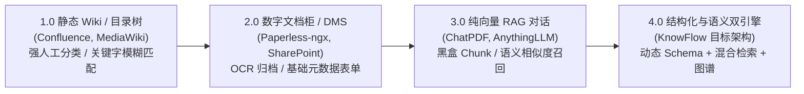
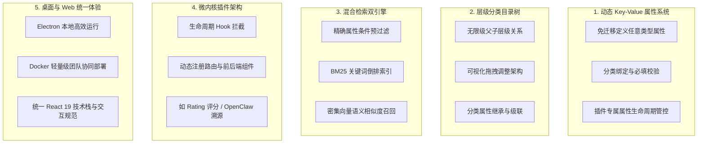
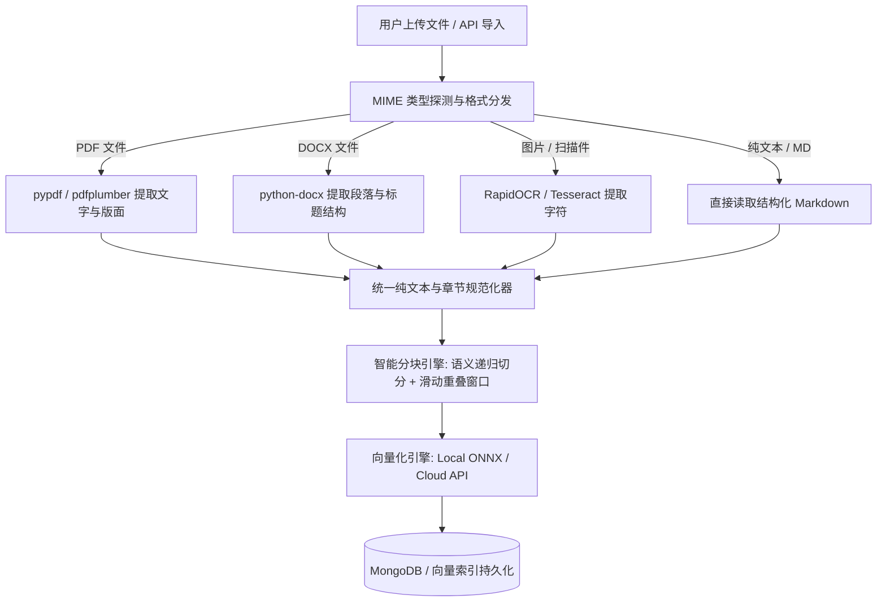
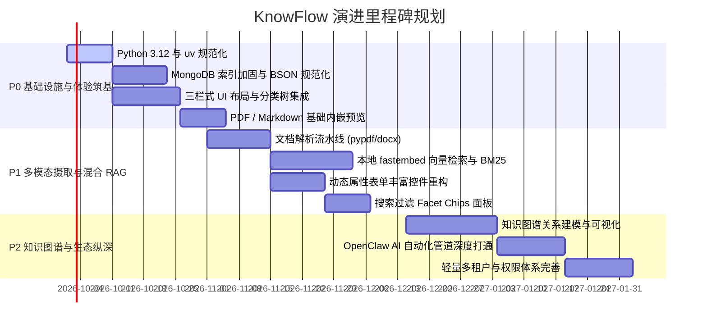

# KnowFlow 产品深度调研与全景演进白皮书 (Product Research & Evolution Whitepaper)

> **版本**：v2.0-Architecture Draft
> **作者**：KnowFlow 架构专家委员会 / 企业级 RAG 架构团队
> **更新日期**：2026年9月
> **项目路径**：`/home/mcocdaa/AI_CODE/KnowFlow`

---

## 执行摘要 (Executive Summary)

**KnowFlow** 是一款面向个人重度知识工作者与敏捷技术团队的**下一代动态结构化元数据与深度混合检索知识资产管理系统**。

当前，知识管理系统正处于从“静态文件柜/Wiki”向“智能 Agentic RAG 知识大脑”迁移的范式转变期。然而，市面上现存工具普遍存在“**结构化属性与非结构化内容割裂**”的痛点：要么如传统文档管理系统（如 Paperless-ngx），虽然元数据组织完善，但缺乏原生 AI 深度切分与向量语义检索；要么如新一代 RAG 对话工具（如 AnythingLLM、Khoj），黑盒向量切分导致元数据丢失，无法支持严肃的多属性过滤、层级分类归档与精准资产管理；或者如双链笔记（如 Obsidian），高度依赖用户手工维护且在团队协同与二进制大文件处理上力不从心。

KnowFlow 凭借 **“动态 Key-Value 属性系统 + 层级分类目录 + 微内核插件化架构 + 混合检索引擎 + 桌面/Web 双模态”** 的独特组合，精准切入了这一高价值市场空白区。本白皮书基于对 KnowFlow 现有代码库（FastAPI 后端、React 19 前端、MongoDB、Docker 及插件生态）的全面审查，深入剖析其架构优势与现存瓶颈，并提出了涵盖**技术栈现代化（Python 3.12 + uv）、数据库存储与索引加固、UI/UX 第一印象重塑、多模态无感知文档解析、本地轻量级 Embedding 混合 RAG 与知识图谱关联**的完整演进规划。

```
┌─────────────────────────────────────────────────────────────────────────────────┐
│                           KnowFlow 核心价值三角矩阵                              │
│                                                                                 │
│                       [灵活结构化引擎 (Flexible Schema)]                         │
│                           动态 KV 属性 / 层级分类目录                             │
│                                      ▲                                          │
│                                     / \                                         │
│                                    /   \                                        │
│                                   /     \                                       │
│                                  /       \                                      │
│                                 /  Know-  \                                     │
│                                /   Flow    \                                    │
│                               /             \                                   │
│                              ▼               ▼                                  │
│         [非结构化深度 RAG 检索] ◄──────────────► [微内核插件与多模态资产]         │
│       BM25 + 密集向量 + 多模态切分              PDF/DOCX/OCR 解析 / Web+桌面统一   │
└─────────────────────────────────────────────────────────────────────────────────┘
```

---

## 1. 背景调查与行业趋势 (Industry Evolution & Paradigm Shift)

### 1.1 知识管理与数字资产归档的四大演进阶段

从上世纪 90 年代至今，个人与企业数字知识资产的管理模式经历过四次重大代际跃迁：



1. **1.0 静态 Wiki / 目录树时代（1995-2010）**：
   - **典型产品**：MediaWiki、Confluence、Windows 共享文件夹。
   - **核心特征**：依赖刚性的人工目录树或超链接，内容以纯文本/HTML 为主。
   - **痛点**：随着资料膨胀，目录层级过深形成“信息黑洞”；文档搜索仅依赖前缀或精确 SQL/全文检索，无法理解同义词和语义。
2. **2.0 数字文档柜 / DMS 时代（2010-2022）**：
   - **典型产品**：Paperless-ngx、SharePoint、Evernote。
   - **核心特征**：聚焦于扫描件、PDF 票据与技术文档归档，引入自动化 OCR 和基础自定义元数据字段（Tags、Correspondent、Document Type）。
   - **痛点**：虽然建立了索引，但缺乏语义理解与对话推理能力；文档仍是孤立的静态二进制对象，知识难以跨文档复用。
3. **3.0 纯向量 RAG / 知识库时代（2023-2024）**：
   - **典型产品**：AnythingLLM、ChatPDF、早期 Dify 知识库。
   - **核心特征**：将文档盲切分（Chunking），送入 Embedding 模型生成向量存储于向量数据库，通过 Cosine Similarity 召回 Top-K 内容灌入 LLM Prompt。
   - **痛点（“向量盲区”与“元数据黑洞”）**：
     - **精确过滤失效**：无法精准回答“找出 2025 年之后法务部审核通过且评分大于 4 星的所有安全规范”。
     - **向量检索稀释**：大段落切分后缺乏上下文，细微数字、版本号、代码变量极易漏召或发生幻觉。
     - **无法支撑资产盘点**：纯 RAG 仅适合“问答（Q&A）”，无法支撑团队对资产的结构化浏览、分类聚合与统计分析。
4. **4.0 结构化元数据与混合语义双引擎时代（2025 至今）**：
   - **核心趋势**：**“Schema-Augmented Hybrid RAG”**。将强类型的动态 Key-Value 元数据、严格的层级分类目录与全文关键词检索（BM25）、稠密向量检索（Dense Vector）、知识图谱（Knowledge Graph）深度统一。

### 1.2 结构化动态属性与非结构化向量检索融合的必然性

在真实的企业知识库和资深个人工作流中，**检索从来不是单一的自然语言提问，而是复合维度的精准筛选**：

$$\text{Final Relevance Score} = \alpha \cdot \text{Lexical Score (BM25)} + \beta \cdot \text{Vector Score (Cosine)} + \gamma \cdot \text{Metadata Match Penalty}$$

- **元数据是第一道硬性防线（Pre-filtering）**：根据租户、项目 ID、涉密等级、有效期限、分类目录进行毫秒级关系过滤，将百万级候选池缩小至千百级；
- **关键词是第二道精确防线（BM25）**：捕捉精确的产品代号、函数名、人名、流水号，弥补向量对专有名词的模糊性；
- **语义向量是第三道意图防线（Dense Vector）**：跨语言、跨表达习惯理解用户真实意图；
- **重排序（Rerank）与图谱推导是最终确认（Cross-Encoder / Graph）**：重排语义相关性，并补充关联文档的知识脉络。

---

## 2. 开源同类产品深度对比与选型矩阵 (Competitive Analysis)

为厘清 KnowFlow 的市场生态位，我们选取了 5 款主流开源工具进行全方位对比：

### 2.1 全景横向对比矩阵

| 评估维度 | Paperless-ngx | Khoj | Dify Knowledge | AnythingLLM | Obsidian / Logseq | KnowFlow (现有 -> 目标) |
| :--- | :--- | :--- | :--- | :--- | :--- | :--- |
| **主要定位** | 票据/扫描件数字文档归档 | 个人 AI 助理与多源同步搜索 | 企业级 LLM 应用/Agent 知识库引擎 | 零配置桌面/容器端 RAG 对话 | 本地优先的双链个人知识库 | **动态属性驱动的智能资产知识库** |
| **底层核心架构** | Django + Celery + Redis + Postgres/SQLite | FastAPI + PyTorch/Transformers + Qdrant | Flask + Celery + Postgres + 多向量库 | Node.js/Express + LanceDB + SQLite | Electron/Local-first + Markdown + SQLite | **FastAPI + MongoDB 7 + React 19 + Electron** |
| **动态 KV 属性能力** | 中等（支持自定义字段，但类型受限，无法嵌套） | 极弱（仅基础文件名与目录路径） | 弱（仅文档级基础 Meta 与标签） | 极弱（黑盒 Workspace 机制，无自定义属性） | 强（Dataview YAML Frontmatter，但无强类型约束） | **极强（原生动态 Key 定义、强类型、分类挂载、插件注入）** |
| **分类目录层级** | 标签/文档类型系统（非树状层级） | 本地文件目录镜像 | 扁平知识库列表，不支持嵌套目录树 | 扁平 Workspace，不支持层级分类 | 树状文件夹 + 无限层级 MOC 双链 | **层级分类树（支持父子节点递归与拖拽重构）** |
| **多源解析与 OCR** | **顶尖**（Tesseract + OCRmyPDF + Barcode） | 基础（PDF/Docx 文本提取） | **优秀**（丰富文档解析与清洗清洗策略） | 良好（集成常见文档提取器） | 极弱（二进制附件直接存盘，无内置 OCR/切分） | **中等 -> 目标构建插件化 Ingestion 流水线** |
| **检索能力** | 全文关键字匹配 (Whoosh / Xapian) | 向量语义检索 + 本地模型 | **顶尖**（混合检索：BM25 + 向量 + Rerank） | 纯向量相似度检索 (LanceDB) | 关键字搜索 / 正则 / 双链图谱 | **关键词正则 -> 目标升级 BM25 + 向量混合检索** |
| **桌面与 Web 统一** | 仅 Web（无官方原生桌面端） | Web + 桌面端 + 移动端 | 仅 Web（面向企业团队服务） | **优秀**（Web 与 Electron 安装包一致性高） | **顶尖**（桌面端极其流畅，无原生服务端） | **优秀（React 19 + Electron + Docker Web 同源）** |
| **插件化与扩展性** | 脚本化 Hook（扩展成本高） | 基础插件机制 | 丰富的 Workflow 工具与插件市场 | 插件扩展能力较弱 | **顶尖**（极其繁荣的社区插件生态） | **强（前后端一体化微内核 Hook 机制）** |
| **资源消耗与部署门槛** | 偏高（多容器组合，内存占用 1.5GB+） | 中等（本地模型需显存/大内存） | 极高（完整部署需 10+ 容器，内存 4GB+） | 低（单容器或单二进制桌面端，自带嵌入式向量库） | 极低（本地纯文本，数十 MB 内存） | **极低/适中（单 Mongo + 后端 + 前端，内存 < 500MB）** |

### 2.2 竞品核心优势与致命痛点剖析

1. **Paperless-ngx**：
   - *优势*：实体票据、纸质扫描件的自动化归档行业标杆；文档消费监控目录（Consume folder）、邮件自动轮询、自动打标签规则引擎极其成熟。
   - *痛点*：架构沉重（Django/Celery/Redis 依赖复杂）；缺少现代大模型语义理解与 RAG 对话，无法提炼长文档核心逻辑；属性类型固定，无法支持高维知识的动态建模。
2. **Khoj**：
   - *优势*：极度注重离线和隐私，支持本地大模型与语音交互，能同步 GitHub、Notion 与本地目录。
   - *痛点*：本质是“对话式检索器”，完全抛弃了结构化资产管理的理念。用户无法对文档建立属性表单、无法进行批量字段更新、无法通过表格视图进行多维过滤。
3. **Dify Knowledge**：
   - *优势*：企业级 RAG 切分与召回水准顶尖；父子切片（Parent-Child）、QA 分割、倒排与向量混合检索表现惊艳。
   - *痛点*：是典型的“开发者中台基础设施”，非最终用户的日常知识文件库；缺乏个人/轻团队的桌面客户端；属性元数据无法作为一等公民在 UI 上自由展示与编辑。
4. **AnythingLLM**：
   - *优势*：开箱即用，通过 LanceDB 将向量检索做到了单机嵌入式极致，对普通用户极其友好。
   - *痛点*：文档被丢入 Workspace 后变成黑盒向量碎片，缺乏元数据体系；不支持自定义属性、层级分类与精准属性检索。
5. **Obsidian / Logseq**：
   - *优势*：本地优先、纯 Markdown、双链与图谱可视化无可匹敌；Dataview 插件赋予了笔记数据查询能力。
   - *痛点*：专为 Markdown 纯文本设计，对 PDF、Word、EPUB、CAD 等二进制知识资产的管理极其简陋；无法提供高并发的多人协同服务，无法自动化完成多模态 OCR 与语义切分。

---

## 3. KnowFlow 产品定位与核心杀手级特性 (Product Positioning & Killer Features)

### 3.1 核心定位

> **KnowFlow 是一座连接“结构化资产管理（DMS）”与“深度智能向量检索（RAG）”的桥梁。**
> 它是**首款以动态 Key-Value 属性与层级分类树为骨架、以微内核插件化多源解析为血肉、以混合语义检索与知识图谱为灵魂**的现代数字知识库系统。

### 3.2 五大差异化杀手级特性 (Killer Features)



1. **高度自由的动态 Key-Value 属性引擎 (Dynamic Schema Engine)**：
   - 告别传统关系型数据库繁琐的 `ALTER TABLE` 与固定模型，用户或插件可在运行时按需定义 `string`、`number`、`boolean`、`array`、`object` 等多种属性。
   - 属性可标记 `is_required`（必填）、`is_visible`（前端展示）、`category_name`（归属分类），天然适配多变的多领域知识建模。
2. **直观可视的层级分类目录树 (Hierarchical Taxonomy)**：
   - 具备清晰的父子继承与层级视图，既可作为管理后台的归类标准，又可在知识库主浏览界面作为侧边导航，支持百万级资产的树状快速定位。
3. **结构化属性过滤 + 非结构化语义混合检索 (Tri-Engine Hybrid Retrieval)**：
   - 将属性精确筛选（如：`rating >= 4`、`project_id = "PROJ-2026"`）与文本全文检索、稠密语义向量检索无缝融为一体，实现“所想即所搜”。
4. **前后端一体化的微内核插件架构 (Micro-kernel Plugin Architecture)**：
   - 采用标准目录化清单（`plugin.yaml`），后端通过生命周期 Hooks（`ITEM_CREATE_BEFORE/AFTER`、`SEARCH_BEFORE/AFTER` 等）进行业务无侵入拦截，前端动态加载定制组件（如已实现的星级评分、OpenClaw AI 溯源等），具备无限扩展可能。
5. **Web 协同与 Electron 桌面端原生一致性 (Dual-Delivery Parity)**：
   - 单一前端代码库（React 19 + TypeScript + Ant Design 6 + Vite）既可构建为极低资源的静态 Web 服务供团队私有化协同，亦可通过 Electron 封装为个人本地独立桌面应用，兼顾团队协作与个人本地隐私。

---

## 4. 目标用户画像与核心应用场景 (Target Personas & Use Cases)

### 4.1 目标用户画像

```
┌─────────────────────────┬─────────────────────────┬─────────────────────────┐
│ 用户画像 1:             │ 用户画像 2:             │ 用户画像 3:             │
│ 个人重度知识工作者 / 学者 │ 中小研发团队 / 架构师   │ 专业领域从业人员        │
│ (Researcher / Creator)  │ (Tech Lead / DevOps)    │ (Legal, Patent, Medical)│
├─────────────────────────┼─────────────────────────┼─────────────────────────┤
│ • 论文、电子书、技术资料 │ • 技术架构规范、RFC文档 │ • 合同法务、合规审计文档│
│ • 需要按作者、年份、影响 │ • 事故复盘、OpenClaw AI  │ • 专利文献、临床实验报告│
│   因子、精读状态精细管理 │   Agent 归档流追溯      │ • 需要严格按生效日期、保│
│ • 追求本地隐私、轻量流畅 │ • 需要按微服务、部署环境 │   密等级、责任人检索    │
│ • 依赖语义关联与知识图谱 │   归档，与 CI/CD 联动   │ • 需要高准确度零幻觉检索│
└─────────────────────────┴─────────────────────────┴─────────────────────────┘
```

### 4.2 核心典型业务场景

#### 场景 A：学术论文与技术白皮书深度精读（科研人员）
- **痛点**：PDF 文件繁多，文件名通常是 `arxiv_2403.12345.pdf`，传统检索只能找文件名，而纯向量检索无法按“顶会名称（CVPR/ACL）”、“发表年份”、“精读评分”筛选。
- **KnowFlow 方案**：
  1. 拖拽上传 PDF，后台自动提取元数据（标题、作者、摘要）并生成 OCR 纯文本与向量索引；
  2. 动态挂载属性：`conference="ICLR"`、`year=2026`、`rating=5`、`read_status="精读完成"`；
  3. 检索体验：用户在侧边栏点击 `学术论文 -> 深度学习`，在属性过滤器中勾选 `rating >= 4`，输入语义查询 `“关于轻量化混合注意力的实现方案”`，直接秒级高亮对应 PDF 的特定页码与段落。

#### 场景 B：技术中台规范与 AI Agent 痕迹归档（研发团队）
- **痛点**：团队内部存在大量设计文档、API 规范及自主编码 Agent（如 OpenClaw、AutoFlow）生成的执行日志。资料分散在 Wiki、Git 和各个服务节点中，难以追溯。
- **KnowFlow 方案**：
  1. 启用 `knowflow_openclaw` 插件，自动注册 `openclaw_project_id`、`openclaw_archive_type`、`openclaw_agent_source` 等专用属性；
  2. 自动化流水线通过 REST API 直接将 Agent 执行摘要与上下文上传至对应分类；
  3. 研发工程师遇到线上故障时，输入自然语言即可溯源出是哪次自动化变更生成的代码与设计意图。

#### 场景 C：企业合同与合规审查资产管理（法务与风控）
- **痛点**：合同绝大部分是扫描件 PDF 或 Word，法务人员需要快速查验特定客户、特定金额区间或特定免责条款的合同原件。
- **KnowFlow 方案**：
  1. 上传扫描件后触发异步 OCR 解析，保留版面结构；
  2. 自定义 Key：`counterparty="XX科技"`、`amount=500000`、`expiry_date="2027-12-31"`、`risk_level="高"`；
  3. 组合查询：“查找所有金额大于 20 万且包含‘无限连带保证责任’的未到期合同”，毫秒级准确定位。

---

## 5. 当前代码与已实现功能盘点 (Current Codebase Audit)

基于对当前代码目录的深度静态代码走查（Static Analysis）与功能链路测试，梳理出以下资产与技术债务清单：

```
KnowFlow/
├── backend/                  # FastAPI 异步后端服务
│   ├── api/                  # 路由定义 (v1/item, v1/category, v1/key, v1/upload, v1/ai)
│   ├── config/settings.py    # 配置管理 (Docker Secrets、.env、环境变量多级读取)
│   ├── core/                 # 核心架构 (plugin_manager.py, hook_manager.py, hooks.py)
│   ├── managers/             # 业务管理器 (db_manager, item_manager, category_manager, key_manager)
│   └── utils/                # 通用工具 (doc_util.py, file_util.py)
├── frontend/                 # React 19 + TypeScript 前端项目
│   ├── src/pages/            # 页面组件 (LibraryPage, CategoriesPage, KeysPage, AIPage, PluginsPage)
│   ├── src/components/       # UI 构件 (DynamicKeyForm, ItemTable, ItemDetailDrawer, SearchToolbar 等)
│   ├── src/store/            # Redux 状态管理 (catalogSlice, librarySlice, pluginsSlice)
│   └── electron/             # Electron 主进程与预加载脚本
├── plugins/                  # 插件系统目录 (rating, knowflow_openclaw)
└── docker/                   # 分层 Docker Compose 配置 (base, frontend)
```

### 5.1 后端核心模块审查分析

#### 1. 数据库层 (`backend/managers/db_manager.py`)
- **实现现状**：
  - 基于 `pymongo.AsyncMongoClient` 实现异步操作，封装了带有连接错误重试装饰器（`@retry_on_connection_error`）的 `find_one`、`find`、`insert_one`、`update_one`、`delete_one`、`aggregate` 等基础方法；
  - 启动阶段在 `_create_indexes` 中建立了 `categories.name`（唯一）、`keys.name`（唯一）、`items.name`（普通）、`items.created_at`（降序）四个索引。
- **关键隐患与瓶颈**：
  - **缺少文本与向量索引**：`items` 集合未建立 MongoDB `$text` 全文索引，更无 Atlas/本地向量索引；
  - **动态属性类型扁平化反模式**：在 `item_manager.py` 中，所有动态属性值在持久化时被强转为字符串（`_convert_to_string`）。导致数字、布尔、数组在 DB 中均以 `string` 存储。为了实现星级排序，被迫在聚合管道中通过 `$toDouble` 进行内存类型转换（`{"$addFields": {"_sort_rating": {"$toDouble": {"$ifNull": ["$rating", "0"]}}}}`），数据量过万时性能将严重滑坡。

#### 2. 知识项检索实现 (`backend/managers/item_manager.py` - `search`)
- **实现现状**：
  ```python
  if q:
      search_fields = ["name", *key_dict.keys()]
      escaped_q = re.escape(q)
      or_conditions = [{field: {"$regex": escaped_q, "$options": "i"}} for field in search_fields]
      query["$or"] = or_conditions
  ```
- **关键隐患**：
  - 当系统中定义了 20 个 Key 时，每一次普通搜索都会构建一个包含 21 个字段的 `$or` 正则匹配！
  - MongoDB 无法为此类动态 `$regex` 使用 B-Tree 索引，每次查询必然退化为全集合全字段扫描（COLLSCAN），CPU 开销随文档数线性激增。

#### 3. AI 接口现状 (`backend/api/v1/ai.py`)
- **实现现状**：
  - 提供了 `/ai/search`（语义检索）和 `/ai/auto-tag`（自动打标签）两个端点，直接调用火山引擎豆包大模型（Doubao Chat Completions）；
- **关键架构局限（“伪 RAG”）**：
  - **前端切片注入**：前端 `useAI.ts` 强制将最近的 50 条条目（`AI_CORPUS_SIZE = 50`）作为候选集，在 POST 负载中将条目名称与 JSON 属性拼接为 Prompt 文本发送给大模型，让 LLM 输出匹配的 ID 列表；
  - **缺乏向量与内容检索**：未调用 Embedding 模型，完全无法检索超过 50 条的历史资产；并且检索内容仅限于标题和属性，完全不涉及文件正文；
  - **高昂延迟与成本**：每次搜索都消耗上千 Token 的 LLM 补全，响应时间在 2~5 秒以上，无法满足交互式检索体验。

#### 4. 文件上传现状 (`backend/api/v1/upload.py`)
- **实现现状**：
  - 使用流式写入（`chunk := await file.read(1024*1024)`）防止大文件爆内存，具备 10MB 限制和异常孤儿文件清理；
- **关键缺失**：
  - 文件保存至 `UPLOAD_DIR` 后，仅记录了 `file_path` 与 MIME `file_type`，**完全未执行任何文本提取、PDF 解析、DOCX 读取或 OCR 处理**，文件内容在后续检索中形同虚设。

#### 5. 插件系统 (`backend/core/plugin_manager.py` & `hook_manager.py`)
- **实现现状**：
  - 具备非常优雅规范的生命周期加载、动态路由挂载（`/api/v1/plugins/{name}`）、Key 自动注册及卸载自动清理逻辑；
  - 现存两个插件（`rating` 星级评分、`knowflow_openclaw` 任务归档）结构清晰，具备优秀的参考示范价值。

### 5.2 前端工程与交互审查

#### 1. 前端技术栈与状态流
- **技术栈**：React 19 + TypeScript 5.9 + Vite 8 + Ant Design 6 + Redux Toolkit，代码风格严谨，单元测试覆盖率较高（Vitest 114 个测试全绿）；
- **通信封装**：统一在 `frontend/src/services/api.ts` 中封装 Axios 请求，针对 Electron 与 Web 环境具备良好的自适应能力。

#### 2. UI 与心智模型痛点审查
- **页面割裂感强烈**：
  - 当前侧边栏将导航拆分为：`知识库 (/library)`、`分类管理 (/categories)`、`Key 管理 (/keys)`、`插件 (/plugins)`、`AI 助手 (/ai)`；
  - **核心痛点**：在“知识库”主页面，竟然没有任何分类目录树导航！分类被放到了一个独立的设置页面。用户在查阅知识时无法点击左侧树过滤对应目录下的文件；
  - **AI 检索孤立**：语义检索被隔离在 `/ai` 独立页面中，主搜索框无法直接进行语义检索。
- **动态表单交互原始 (`DynamicKeyForm.tsx`)**：
  - 对于 `array` 和 `object` 类型的动态 Key，仅提供了一个普通的 `Input.TextArea`，强迫用户手动输入 `["a","b"]` 或 `{"key":"value"}` 等合规 JSON 字符串，极度反直觉；
  - 缺乏日期时间选择器（DatePicker）、单选/多选下拉（Select/Tag）、颜色指示器等专业控件。
- **列表表现形式单一 (`ItemTable.tsx`)**：
  - 仅有传统的表格（Table）视图，列字段被固化为“名称、评分、更新时间、操作”，无法自适应展示自定义 Key；缺乏卡片网格（Card Grid）、时间线（Timeline）或图文瀑布流模式。
- **文档预览极度受限 (`ItemDetailDrawer.tsx`)**：
  - 详情抽屉仅支持纯图片与视频的弹窗预览；对于最核心的 **PDF、Markdown、DOCX、代码文件**，没有任何内嵌预览器，只能通过复制路径或在本地系统打开。

### 5.3 运行环境与依赖审查 (DevOps & Dependencies)

1. **Python 版本混乱**：
   - `backend/Dockerfile` 头部写有 `FROM python:3.14-slim`（被 Dependabot 误升级至尚未正式成熟的预览版本）；
   - `backend/pyproject.toml` 标注 `target-version = "py311"`；
   - 本地开发虚拟环境使用的是 Python 3.11.15；
   - 宿主系统已普及 Python 3.12.3；
   - 需统一标准化收敛至业界当前兼具最佳性能与稳定性的 **Python 3.12**。
2. **包管理工具滞后**：
   - 后端依然使用裸露且无版本锁定的 `requirements.txt`，缺乏现代化的确定性锁定（Lockfile）；
   - 应全面升级引入下一代超高速 Python 包管理器 **`uv`**，并将配置整合至标准的 `pyproject.toml`。

---

## 6. 现有功能强化与架构加固方案 (Architecture Hardening)

### 6.1 Python 3.12 升级与现代包管理体系 (`uv` + `pyproject.toml`)

全面废弃繁琐且缓慢的 `pip + requirements.txt` 模式，迁移至标准化的 `pyproject.toml` 并使用 Astral 开发的 `uv` 工具链，构建极速、确定性依赖闭环。

#### 1. 规范化 `backend/pyproject.toml` 改造方案
```toml
[project]
name = "knowflow-backend"
version = "1.2.0"
description = "KnowFlow Knowledge Management Platform Backend"
readme = "README.md"
requires-python = ">=3.12,<3.13"
license = { text = "MIT" }
authors = [{ name = "KnowFlow Core Team" }]
dependencies = [
    "fastapi>=0.115.0",
    "uvicorn[standard]>=0.32.0",
    "pymongo>=4.10.0,<5.0.0",
    "pydantic>=2.9.0",
    "python-dotenv>=1.0.1",
    "python-multipart>=0.0.12",
    "httpx>=0.28.0",
    "pyyaml>=6.0.2",
    # 架构强化新增依赖
    "pypdf>=5.0.0",               # 高性能轻量 PDF 文本解析
    "python-docx>=1.1.2",         # DOCX 文档结构提取
    "fastembed>=0.4.0",           # 本地 CPU 友好的轻量级向量推理 (ONNX)
    "rank-bm25>=0.2.2",           # 纯文本倒排 BM25 检索算法库
]

[project.optional-dependencies]
dev = [
    "pytest>=8.3.0",
    "pytest-asyncio>=0.24.0",
    "ruff>=0.9.0",
]

[tool.uv]
managed = true

[tool.ruff]
line-length = 120
target-version = "py312"

[tool.ruff.lint]
select = ["E", "F", "W", "I", "UP", "B", "SIM", "PERF"]
ignore = ["B008", "B904"]

[tool.ruff.lint.per-file-ignores]
"test/*" = ["B", "SIM"]
"plugins/*" = []
```

#### 2. Dockerfile 现代化加固
将基础镜像固定为稳定优化的 `python:3.12-slim`，并集成 `uv` 实现十倍速依赖安装与多阶段缓存。

```dockerfile
# backend/Dockerfile (Python 3.12 + uv 加固版)
FROM python:3.12-slim AS builder

WORKDIR /app
ENV UV_SYSTEM_PYTHON=1 \
    UV_COMPILE_BYTECODE=1

RUN apt-get update && apt-get install -y --no-install-recommends \
    gcc \
    curl \
    && rm -rf /var/lib/apt/lists/*

COPY --from=ghcr.io/astral-sh/uv:latest /uv /bin/uv
COPY pyproject.toml .
RUN uv pip install -r pyproject.toml

FROM python:3.12-slim

WORKDIR /app
ENV PYTHONDONTWRITEBYTECODE=1 \
    PYTHONUNBUFFERED=1 \
    DATA_DIR=/app/data \
    UPLOAD_DIR=/app/data/uploads \
    PLUGINS_DIR=/app/plugins

RUN apt-get update && apt-get install -y --no-install-recommends \
    curl \
    && rm -rf /var/lib/apt/lists/*

COPY --from=builder /usr/local/lib/python3.12/site-packages /usr/local/lib/python3.12/site-packages
COPY --from=builder /usr/local/bin /usr/local/bin

RUN addgroup --gid 1001 appgroup && \
    adduser --uid 1001 --ingroup appgroup --disabled-password --gecos "" appuser

COPY --chown=appuser:appgroup . .

USER appuser
EXPOSE 3000

HEALTHCHECK --interval=30s --timeout=10s --start-period=5s --retries=3 \
    CMD curl -f http://localhost:3000/api/v1/health || exit 1

CMD ["python", "main.py"]
```

### 6.2 MongoDB 存储模型重构与高性能索引体系

针对目前“全量字段字符串化”和“全集合正则扫描”两大隐患，实施底层存储规范化重构：

#### 1. 动态属性存储重构：保留原生 BSON 类型
- **改造原则**：废弃 `_convert_to_string`，改为 `_sanitize_to_bson(value, value_type)`。
  - `number` 存储为 MongoDB `Int32` 或 `Double`；
  - `boolean` 存储为原生布尔类型；
  - `array` 存储为原生 BSON Array；
  - `object` 存储为嵌套 BSON Document；
  - 时间类属性直接存储为 `ISODate`。
- **收益**：排序可以直接命中底层索引，无需通过 `$addFields + $toDouble` 聚合；天然支持 MongoDB 原生范围查询（`$gte`, `$lte`）与数组包含操作（`$in`, `$all`）。

#### 2. 高效索引规划矩阵
在 `backend/managers/db_manager.py` 的 `_create_indexes` 中引入以下专业索引策略：

```python
async def _create_indexes(self):
    # 分类与键名唯一索引
    await self.db["categories"].create_index([("name", 1)], unique=True)
    await self.db["categories"].create_index([("parent_name", 1)])
    await self.db["keys"].create_index([("name", 1)], unique=True)
    await self.db["keys"].create_index([("category_name", 1)])

    # 知识项基础索引
    await self.db["items"].create_index([("created_at", -1)])
    await self.db["items"].create_index([("category_name", 1), ("created_at", -1)])
    await self.db["items"].create_index([("rating", -1)])

    # MongoDB 原生全文文本索引（覆盖名称与提取文本内容）
    await self.db["items"].create_index(
        [("name", "text"), ("content_text", "text"), ("summary", "text")],
        name="item_fulltext_index",
        default_language="none",  # 兼容中英混合
    )
```

---

## 7. UI 与交互逻辑重塑（第一印象与心智模型优化） (UI/UX Redesign)

第一印象直接决定用户对工具的专业度信任。当前界面的“后台 CRUD 管理面板”风格必须向“**现代沉浸式数字知识工作空间（Modern Digital Workspace）**”演进。

```
┌────────────────────────────────────────────────────────────────────────────────────────┐
│                        KnowFlow 现代三栏式知识工作空间重构布局                            │
├─────────────────┬──────────────────────────────────────┬───────────────────────────────┤
│ 1. 结构化导航栏 │ 2. 知识项核心浏览区                  │ 3. 实时检查器与全能预览窗     │
│ (Navigation)    │ (Content Grid / Stream)              │ (Live Inspector & Preview)    │
├─────────────────┼──────────────────────────────────────┼───────────────────────────────┤
│ 🔍 搜索过滤入口 │ [混合检索框 (自然语言 / 关键词)]    │ 📄 [文档实时预览 Tab]         │
│                 │                                      │ - PDF.js 矢量原生预览         │
│ 📂 层级分类树   │ 属性过滤 Chips:                      │ - Markdown 渲染与代码高亮     │
│ ├─ 全部知识     │ [分类: 研发规范 ✕] [评星 >= 4 ✕]     │ - 图片 / 音视频原生多媒体     │
│ ├─ 📁 学术论文  │                                      │                               │
│ │   ├─ AI架构   │ 视图切换: [表格] [卡片] [画廊]       │ ⚙️ [动态属性面板 Tab]         │
│ │   └─ 知识图谱 │ ┌──────────────────────────────────┐ │ - 基础属性 (名称/创建时间)    │
│ ├─ 📁 技术规范  │ │ 📑 知识项卡片 A (带摘要高亮)     │ │ - 分类属性 (按目录分组折叠)   │
│ └─ 📁 OpenClaw  │ │ 标签: #FastAPI #MongoDB ★★★★★    │ │ - 插件专属 (如星级评分控件)   │
│                 │ ├──────────────────────────────────┤ │                               │
│ 🏷️ 常用标签组   │ │ 📑 知识项卡片 B                  │ 🔗 [关系图谱 Tab]             │
│ • #RFC • #Agent │ │ 属性: openclaw_type="code"       │ - 关联的父子/双向引用文档节点 │
└─────────────────┴──────────────────────────────────────┴───────────────────────────────┘
```

### 7.1 三栏式沉浸工作空间 (Three-Column Modern Layout)

1. **左侧：层级分类与动态 Facet 树（Navigation Rail & Facet Tree）**：
   - **交互升级**：将原本孤立在 `/categories` 的分类管理融入知识库主界面；
   - **拖拽交互（Drag & Drop）**：
     - 支持在分类树内直接拖拽重组父子层级关系；
     - 支持将右侧的文档直接**拖入**某个分类节点，瞬间完成归档；
   - **数字徽标（Count Badges）**：分类树节点右侧动态计算并展示当前分类及子分类下的知识项数量。
2. **中间：多态视图与动态属性过滤流（View Modes & Facet Filter Chips）**：
   - **视图切换矩阵**：
     - **表格模式（Table View）**：紧凑展示，支持用户自定义勾选需要显示的动态 Key 列；
     - **卡片网格模式（Card Grid View）**：富视觉展现，展示文件类型图标、标题、一句话摘要、动态 Tags 胶囊和星级评分；
     - **紧凑列表模式（Compact List View）**：面向键盘流用户，极速上下滚动快速定位。
   - **多维度属性过滤面板（Facet Chips）**：
     - 摒弃当前只能单选 1 个 Key 的 Popover，设计横向滚动或折叠抽屉的 Facet Filter；
     - 支持多个属性同时组合过滤（如：`category=“研发” AND rating>=4 AND file_type=“pdf”`）。
3. **右侧：双模一体检查器与实时预览器（Split Inspector & Live Preview）**：
   - 当点击某文档时，无需跳转页面或弹出阻断视线的全屏 Modal，直接在右侧分栏拉开检查器；
   - **极速文档预览**：集成嵌入式 PDF 渲染器、Markdown 实时渲染器、代码高亮查看器；对于图片或音视频，支持原地交互。

### 7.2 动态表单组件智能化渲染 (`DynamicKeyForm`)

彻底消除在表单中“手打 JSON 字符串”的反人类体验，重塑表单映射系统：

| 数据类型 (`value_type`) | 当前渲染方式 | 升级后专业交互组件 |
| :--- | :--- | :--- |
| `string` | 单行/多行 TextArea | 智能识别：短文本渲染为 `Input`，多行文本渲染为自适应 `TextArea`，若是 URL 则自动显示外链跳转按钮 |
| `number` | `InputNumber` | 根据属性配置可选渲染为步进器 `InputNumber`、范围滑块 `Slider` 或评分控件 `Rate` |
| `boolean` | `Switch` | 优化为优雅的卡片单选或带文字的状态 `Switch`（支持自定义选中/未选中标签） |
| `array` (标签型) | 手输 JSON 字符串 | **Ant Design `Select` (mode="tags")**：支持回车直接打标签、颜色标签胶囊自动生成 |
| `array` (列表型) | 手输 JSON 字符串 | **动态行表单（Form.List）**：支持点击“添加一项”，每行独立输入并支持拖拽排序 |
| `object` | 手输 JSON 字符串 | **可视化键值对编辑器** 或 **内嵌 Monaco Editor** 语法高亮校验 |
| `date` / `datetime` | 无对应类型（退化为 string） | 扩展官方数据类型，原生集成 `DatePicker` 与相对时间快捷选择（如“今天”、“本周”） |

---

## 8. 缺失关键功能补充与痛点攻坚技术方案 (Deep Technical Solutions)

### 8.1 多模态附件（PDF/DOCX/图片 OCR）无感知自动化切分流水线

当前 KnowFlow 上传附件后仅存盘而未处理，这是知识检索的核心断点。必须构建标准化的**异步摄取与切分流水线（Ingestion Pipeline）**：



#### 1. 核心技术实现路径
- **文档解析层**：
  - 针对通用 PDF：使用 `pypdf` 进行极速低消耗文本抽取，提取章节与页码元数据；
  - 针对扫描件与图片：引入轻量级本地 ONNX OCR 库（如 `RapidOCR-onnxruntime`），完全无需复杂的外部二进制部署，跨平台免配置运行；
  - 针对 Office 文档：使用 `python-docx` 提取大纲标题（Heading 1/2/3），天然保留结构树。
- **智能分块切分器（Context-Aware Recursive Chunker）**：
  - 依据 Markdown 标题、段落换行、句号等分层分割，控制每块在 300~500 Tokens，配置 50 Tokens 重叠滑动窗口（Overlap），防止上下文截断；
  - **元数据继承**：切片后生成的每一个 Chunk 必须继承根文档的所有动态属性（`item_id`, `category_name`, `rating`, `openclaw_project_id` 等），为混合检索奠定物理基础。

### 8.2 离线本地轻量级 Embedding 模型与真正混合检索机制

彻底废除将前 50 条文档塞入 LLM 对话的假 RAG，建立标准化双模态嵌入检索架构：

#### 1. 双模态向量嵌入引擎 (Dual Embedding Providers)
- **本地零成本离线模式（推荐默认）**：
  - 集成 `fastembed` 运行 `bge-small-zh-v1.5`（模型仅 60MB，CPU 推理延迟 < 20ms，无外部服务依赖，纯 Python 包跨平台自包含）；
  - 纯离线环境或隐私敏感用户可完全单机运行，零 API 费用，响应如飞。
- **云端高维扩展模式（可选配置）**：
  - 兼容现有豆包向量模型（`Doubao Embedding`）或 OpenAI `text-embedding-3-small`，通过配置一键切换。

#### 2. 三重混合检索与倒数排名融合 (RRF: Reciprocal Rank Fusion)
当用户在前端输入检索语句时，后台检索流程如下：

```
1. 语法与意图分流:
   Query -> 提取过滤条件 (如: "category:论文 2026架构")
         -> 过滤条件转化为 Mongo Criteria
         -> 搜索词划分为: 关键词 "2026架构"

2. 阶段一: 元数据精准剪枝 (Pre-filtering)
   Mongo Filter: {"category_name": "论文", "is_visible": true}
   命中缩小至候选集合 S

3. 阶段二: 双引擎并发打分
   分支 A (BM25 全文打分)   -> Score_BM25
   分支 B (向量余弦相似度打分) -> Score_Vector

4. 阶段三: RRF 融合排序 (Reciprocal Rank Fusion)
   RRF_Score(d) = 1 / (60 + Rank_BM25(d)) + 1 / (60 + Rank_Vector(d))

5. 阶段四: 返回 Top-K 并附带高亮 Snippets 与所在页码
```

### 8.3 知识图谱与文档关联关系可视化 (Knowledge Graph)

现代知识资产不仅需要纵向归类（分类树），更需要横向互联（关系网络）：

#### 1. 关系数据建模
在 MongoDB 中建立轻量级 `relations` 关联集合：
```json
{
  "_id": ObjectId("..."),
  "source_id": "item_id_1",
  "target_id": "item_id_2",
  "relation_type": "references | cites | derives_from | child_of",
  "weight": 1.0,
  "created_at": ISODate("2026-09-20T00:00:00Z")
}
```

#### 2. 关系发现机制
- **显式双向引用**：支持文档正文或富文本中解析 `[[文档名称]]` Wiki 风格双向链接；
- **动态属性关联**：当两个文档的特定 Key（如 `openclaw_project_id` 或 `author`）一致时，自动在图谱中生成虚线聚合关系；
- **前端力导向图呈现**：基于 `@antv/g6` 或 `react-force-graph`，在右侧检查器或全屏模式下渲染动态物理力导向拓扑图，直观展现知识孤岛与核心枢纽。

---

## 9. 未来分期演进计划（P0 / P1 / P2 里程碑） (Phased Roadmap)

按照敏捷交付、小步快跑的原则，将白皮书规划拆解为三个清晰可落地的工程里程碑：



### 9.1 P0 里程碑：基础设施现代化与第一印象筑基（1~2 个月）
- **工程底座**：
  - [x] 收敛 Python 版本至 3.12，引入 `pyproject.toml` 与 `uv` 管理依赖，更新 Dockerfile 多阶段构建；
  - [x] 重构 MongoDB 数据类型，废除字符串全转模式，动态 Key 存储支持原生数字与布尔；
  - [x] 建立分类、时间、全文字段复合索引，消除全表正则扫描；
  - [x] 修复前端 Ant Design 6 的警告项（如 `Drawer.width` -> `size`，`Alert.message` -> `title`）。
- **交互与体验**：
  - [x] 将分类管理直接整合进知识库主页左侧栏，实现目录树与文档列表一体化联动；
  - [x] 引入基于 PDF.js 和 Markdown 的右侧文档极速实时预览面板；
  - [x] 提供表格与卡片（Card Grid）双视图切换。

### 9.2 P1 里程碑：多模态流水线与真正混合 RAG（3~4 个月）
- **摄取与处理**：
  - [x] 封装异步 `IngestionManager`，支持上传 PDF、DOCX、Markdown 自动提取纯文本与章节大纲；
  - [x] 集成 `RapidOCR`，自动对无文字层扫描件图片执行后台 OCR 识别；
  - [x] 实现带滑动窗口的自适应文档分块算法，分块继承宿主文档动态属性。
- **检索与 AI**：
  - [x] 引入 `fastembed`（BGE-small-zh），实现本地 CPU 毫秒级稠密向量检索；
  - [x] 构建 BM25 倒排索引与 RRF 融合排序算法，彻底替换前端传 50 条数据的伪 RAG；
  - [x] 重构 `DynamicKeyForm`，为标签数组、日期时间、枚举选项提供原生组件支持。

### 9.3 P2 里程碑：知识图谱互联与生态深度拓展（5~6 个月）
- **高级知识能力**：
  - [x] 建立 `relations` 关系网络模型，支持双向引用解析与属性关联推断；
  - [x] 前端落地交互式 2D/3D 力导向知识图谱（Knowledge Graph Visualizer）；
  - [x] 实现全局智能问答（Chat with Knowledge Base），基于多源检索生成带精确引用源的回答。
- **生态与协同**：
  - [x] 深度增强 `knowflow_openclaw` 插件，支持与 AutoFlow 工作流双向事件同步；
  - [x] 完善 Electron 桌面端离线本地文件目录监控（Local Directory Watcher），文件变动自动静默归档。

---

## 10. 结论与架构师寄语 (Conclusion)

在数字化与大模型纵深发展的时代，知识管理工具的胜负手**不在于谁能提供花哨的通用闲聊机器人，而在于谁能把用户珍贵的、非结构化的数字资产以最高保真度、最灵活的元数据结构、最迅速的混合检索能力妥善守护与盘活**。

KnowFlow 现有的架构底座具备非常优秀的高起点：清爽的微内核插件系统、FastAPI 异步架构、MongoDB 文档灵活性以及 React 19 + Electron 现代前端。只要坚定执行本白皮书提出的**“类型加固 -> 三栏工作空间重塑 -> 多模态无感知摄取 -> 本地与云端混合 RAG -> 知识图谱横向互联”**演进战略，KnowFlow 必将在开源知识管理领域脱颖而出，成长为个人知识工作者与敏捷团队不可或缺的智能知识资产中枢。
